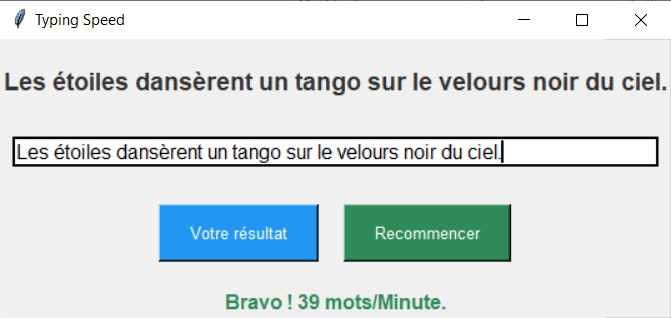

# TySpeed ⌨️


> **Application desktop** de test de vitesse de frappe mesurant les mots par minute (MPM) en temps réel. Démo de développement GUI avec architecture orientée objet.

## 🎯 Objectif du projet

Ce projet fait partie de mon parcours d'apprentissage du développement Python. Il démontre ma capacité à :
- Concevoir une interface graphique desktop complète
- Implémenter une architecture orientée objet propre
- Packager une application Python en exécutable autonome

## 📸 Screenshots


*Interface principale avec calcul en temps réel des MPM*

## ✨ Fonctionnalités

- ⌨️ **Test de vitesse** : Recopie de phrases aléatoires avec chronométrage automatique
- 📊 **Calcul MPM** : Formule standard `(caractères / 5) / minutes`
- ✅ **Détection d'erreurs** : Feedback visuel immédiat sur les erreurs de saisie
- 🔄 **Sessions multiples** : Réinitialisation rapide avec nouvelle phrase
- 🎨 **Interface intuitive** : Boutons contextuels (activation/désactivation selon l'état)
- ⚡ **Exécutable standalone** : Distribution via PyInstaller (pas besoin d'installer Python)

## 🛠️ Technologies

- **Python 3.8+** - Langage principal
- **Tkinter** - Bibliothèque GUI standard Python
- **PyInstaller** - Packaging en exécutable Windows
- **Architecture POO** - Classe `TySpeedApp` pour gestion d'état

## 🚀 Installation

### Option 1 : Exécutable Windows (recommandé)

Téléchargez simplement le fichier `TySpeed.exe` depuis la section [Releases](../../releases) et lancez-le. Aucune installation requise.

### Option 2 : Depuis le code source

```bash
# Cloner le dépôt
git clone https://github.com/ton-username/tyspeed.git
cd tyspeed

# (Optionnel) Créer un environnement virtuel
python -m venv venv
source venv/bin/activate  # Linux/Mac
# ou: venv\Scripts\activate  # Windows

# Lancer l'application
python src/main.py
## 📖 Utilisation

1. **Lancer l'application** : Double-cliquez sur l'exécutable ou lancez `python src/main.py`
2. **Commencer le test** : Cliquez sur "Commencer" - le chronomètre démarre automatiquement
3. **Recopier la phrase** : Tapez la phrase affichée dans le champ de saisie
4. **Valider** : Appuyez sur `Entrée` ou cliquez sur "Valider"
5. **Voir votre score** : Votre vitesse en MPM s'affiche instantanément
6. **Recommencer** : Cliquez sur "Recommencer" pour un nouveau test

## 🧠 Compétences démontrées

- **Architecture POO** : Refactoring d'un code procédural vers une classe `TySpeedApp` avec gestion d'état propre
- **Développement GUI** : Maîtrise de Tkinter (widgets, événements, layout)
- **UX Design** : Gestion intelligente des états de l'interface (boutons contextuels)
- **Algorithmique** : Calcul de performance basé sur la formule standard MPM
- **Packaging** : Distribution d'application Python via PyInstaller
- **Clean Code** : Respect des standards PEP8, type hints, docstrings

## 🏗️ Architecture du projet
tyspeed/
├── src/
│   ├── main.py          # Classe principale TySpeedApp
│   └── phrases.py       # Banque de phrases pour les tests
├── assets/
│   └── screenshots/     # Captures d'écran
├── .gitignore
├── requirements.txt
├── LICENSE
└── README.md
## 📦 Génération de l'exécutable

Pour créer votre propre exécutable Windows :
# Installer PyInstaller
pip install pyinstaller

# Générer l'exécutable
pyinstaller --onefile --windowed --paths=src src/main.py
L'exécutable sera disponible dans le dossier `dist/`.

## 📄 License

MIT License - Voir LICENSE

## 📧 Contact

**Adamou**  
📧 adam00soumana@gmail.com  
🔗 [LinkedIn](https://www.linkedin.com/in/adamou-soumana-a6537a346/)  
🌐 [Portfolio](https://adamou-portfolio.onrender.com/)